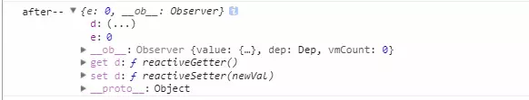
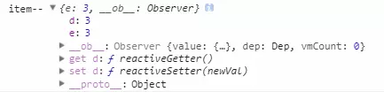
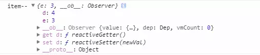
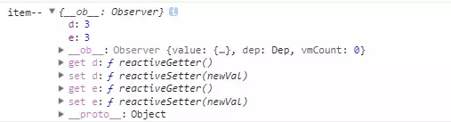
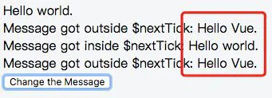

::: tip
随意记录下项目中遇到的有关vue的知识点。
:::

## $set
::: tip
在vue中，如果在实例创建之后添加新的属性到实例上，它不会触发视图更新。--- 官方文档
:::
我们先定义一个对象obj，由于 Vue 会在初始化实例时对属性执行 getter/setter 转化过程，所以属性必须在 data 对象上存在才能让 Vue 转换它，这样才能让它是响应的。此时obj里面的属性d是响应的，但是我们用"."新增了一个属性,此时这个新增的属性不是响应式的，见下：
```js
<template>
     <div>
    <p @click="addd(obj)">{{obj.d}}</p>
    <p @click="adde(obj)"> {{obj.e}}</p>
</div>
</template>

 <script>
  export default {
      data(){
            return {
                obj:{}
            }
      },
      mounted() {
        this.obj = {d: 0};
        this.obj.e = 0;
        console.log('after--', this.obj);
      },
     methods: {
        addd(item) {
            item.d = item.d + 1;
            console.log('item--',item);
        },
        adde(item) {
            item.e = item.e + 1;
            console.log('item--',item);
        }
       }
  }
 </scirpt>  
```

### 初始化的时候控制台的内容


此时d属性有get和set方法的，但是e属性没有，点击三次addd，再点击三次adde，结果如下：

### 分别点击三次后页面的结效果及控制台
`3  0`



我们发现控制台属性e发生了变化，但是页面上并没有更新

### 再点击一次addd的结果
`4  3`



此时发现页面完成了视图更新，由此可以看出，更新新增属性e，是不会更新视图，但是会改变其值，当更新原有属性d时会更新视图，同时将新增的属性e的值也更新到视图里边

### 解决方案
```js
this.$set(this.obj,'e',0)
```
此时点击三次addd，再点击三次adde，结果如下：

`3  3`



此时属性e也加上了get和set方法，此时修改属性e也更新了视图


## vue中mixin的使用
mixix针对的是js中export出来的对象，混入之后便可以this指向js中定义的方法和变量，进行复用
```js
组件引用共有js文件
import Base from '../../../src/brandNew'
export default {
    mixins: [Base]
}
```

### mixin的特点
::: tip
1.方法和参数在组件中不共享：多个组件引用mixin对象的方法和参数，是不会互相影响的。
:::

::: tip
2.值为对象的选项，如methods,components等，选项会被合并，键冲突的组件会覆盖混入对象的：同名的方法和参数，组件的优先级是大于mixin混入的方法和参数。
:::

::: tip
3.值为函数的选项，如created,mounted等，就会被合并调用，混合对象里的钩子函数在组件里的钩子函数之前调用
:::

## this.nextTick()
应用场景：
::: tip
1.在Vue生命周期的created()钩子函数进行的DOM操作一定要放在Vue.nextTick()的回调函数中。
在created()钩子函数执行的时候DOM其实并未进行任何渲染，而此时进行DOM操作无异于徒劳，所以此处一定要将DOM操作的js代码放进Vue.nextTick()的回调函数中。与之对应的就是mounted()钩子函数，因为该钩子函数执行时所有的DOM挂载和渲染都已完成，此时在该钩子函数中进行任何DOM操作都不会有问题 。
:::

::: tip
2.在数据变化后要执行的某个操作，而这个操作需要使用随数据改变而改变的DOM结构的时候，这个操作都应该放进Vue.nextTick()的回调函数中。
:::

```js
<template>
    <div class="app">
    <div ref="msgDiv">{{msg}}</div>
    <div v-if="msg1">Message got outside $nextTick: {{msg1}}</div>
    <div v-if="msg2">Message got inside $nextTick: {{msg2}}</div>
    <div v-if="msg3">Message got outside $nextTick: {{msg3}}</div>
    <button @click="changeMsg">
        Change the Message
    </button>
    </div>
</template>
<script>
export default {
    data(){
        msg: 'Hello Vue.',
        msg1: '',
        msg2: '',
        msg3: ''
    },
    methods:{
        changeMsg() {
            this.msg = "Hello world."
            this.msg1 = this.$refs.msgDiv.innerHTML
            this.$nextTick(() => {
                this.msg2 = this.$refs.msgDiv.innerHTML
            })
            this.msg3 = this.$refs.msgDiv.innerHTML
        }
    }
}
</script>
```

点击后的视图为：



msg1和msg3视图展示的都是之前初始化时的msg数据值，使用了this.nextTick()之后，会等待vue更新完成dom之后再调用里面的方法，即用到最新的dom上的数据。